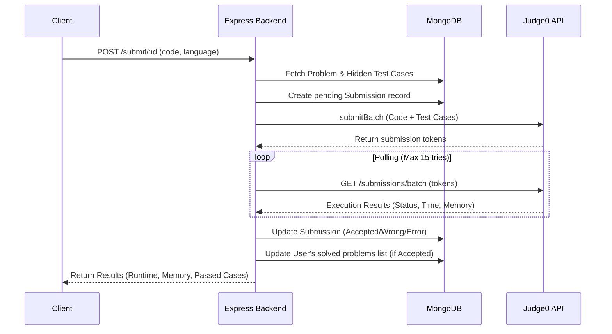

<div align="center">
  <h1>🚀 LeetCode Clone Backend Architecture</h1>
  <p>A robust, scalable backend service for an online coding judge platform.</p>

  <!-- Badges -->
  <p>
    
    
    
    
    
  </p>
</div>

## 📖 Overview

This project is the backend infrastructure for a fully-featured online judging system similar to LeetCode. Designed with scalability and security in mind, it provides robust REST APIs that handle secure user authentication, problem creation (via admin panels), and sandboxed remote code execution.

This repository demonstrates my ability to build complex, stateful backends that integrate third-party services, manage multiple roles, and handle asynchronous job polling.

## ✨ Key Features & Technical Decisions

- **🔒 Secure Authentication & Authorization**
  - **JWT & bcrypt:** Password hashing and stateless authentication.
  - **Redis Token Blacklisting:** Implemented a secure logout mechanism by caching expired tokens in Redis to prevent replay attacks.
  - **Role-Based Access Control (RBAC):** Distinct `admin` and `user` privileges. Only admins can create, modify, or delete coding problems.
- **💻 Remote Code Execution (RCE) via Judge0**
  - Securely compiles and executes user-submitted code in isolated sandboxes using the **Judge0 API**.
  - Supports multiple languages: **C++, Java, and JavaScript**.
  - Uses a **batching & polling mechanism** (`submitBatch`, `submitToken`) to evaluate code against multiple hidden test cases efficiently without blocking the main thread.
- **🗄️ Optimized Database Architecture**
  - **MongoDB & Mongoose:** Highly relational document design.
  - **Compound Indexing:** Utilized compound indexes (`userId` + `problemId`) in the submissions schema via B+ trees to make query lookups blazingly fast.

## 🏗️ System Architecture

The following diagram illustrates the lifecycle of a code submission:



## 🗃️ Database Models

- **User Model:** Stores `firstName`, `emailId`, hashed `password`, `role` (user/admin), and an array of `problemSolved` references.
- **Problem Model:** Contains `title`, `description`, `difficulty` (easy/medium/hard), `tags`, `visibleTestCases` (for dry runs), `hiddenTestCases` (for final evaluation), `starterCode`, and `referenceSolution`.
- **Submission Model:** Links a `userId` to a `problemId`, storing the submitted `code`, `language`, `status` (accepted/wrong/error), `runtime`, `memory`, and error messages.

## 🚀 Getting Started

### Prerequisites

- Node.js (v16+)
- MongoDB instance (Local or Atlas)
- Redis Server

### Installation

1. Clone the repository & install dependencies:

   ```bash
   git clone <your-repo-url>
   cd leetcode-clone-backend
   npm install
   ```

2. Environment Variables (`.env`):

   ```env
   PORT=3000
   SECRET_KEY=your_jwt_secret_key
   # MONGODB_URI and Redis credentials (if not hardcoded in config)
   ```

3. Start the server:
   ```bash
   npm run dev
   ```

## 🔌 API Endpoints Summary

| Route Category     | Endpoints                      | Description                                        |
| :----------------- | :----------------------------- | :------------------------------------------------- |
| **Authentication** | `POST /user/register`          | Register a normal user                             |
|                    | `POST /user/login`             | Login and issue JWT via HTTP-only cookie           |
|                    | `POST /user/logout`            | Logout and blacklist JWT in Redis                  |
|                    | `POST /user/admin/register`    | Register an admin (Requires admin auth)            |
| **Problems**       | `POST /problem/create`         | Create a new coding problem (Admin)                |
|                    | `GET /problem/getallproblem`   | Fetch all problems                                 |
|                    | `GET /problem/problemById/:id` | Fetch specific problem details                     |
| **Submissions**    | `POST /submission/run/:id`     | Execute code against visible test cases            |
|                    | `POST /submission/submit/:id`  | Execute code against hidden test cases, save to DB |

## 🧠 What I Learned / Challenges Overcome

- **Handling Asynchronous Webhooks vs Polling:** Integrating with Judge0 required handling asynchronous processing. I implemented a resilient polling mechanism with a retry limit to fetch execution results efficiently.
- **Token Management:** Learned how stateless JWTs can be problematic for immediate revocation (logout), and solved this by utilizing Redis as an in-memory datastore for blacklisting tokens until they expire.

## 📞 Contact / Portfolio

- **Author:** Souhardya Maji
- **LinkedIn:** [https://www.linkedin.com/in/souhardya-maji/]
- **GitHub:** [https://github.com/Hardoo-009]
