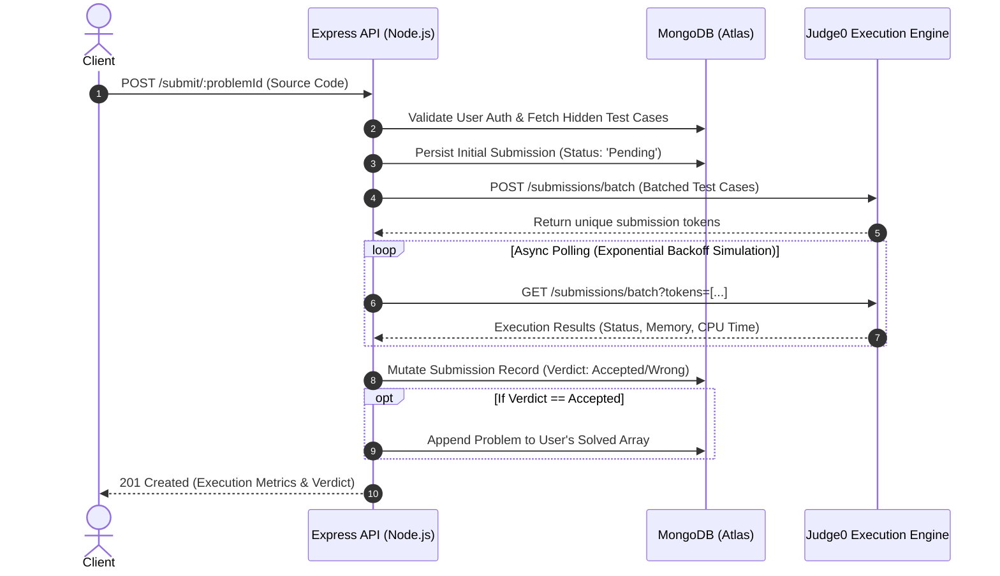
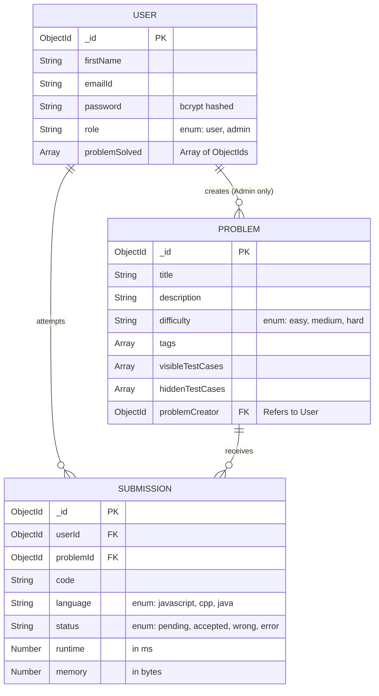

<div align="center">
  <h1>🚀 LeetCode Clone — Scalable Backend Infrastructure</h1>
  <p>An enterprise-grade, highly concurrent backend service for an online coding judge platform.</p>

  <!-- Badges -->
  <p>
    
    
    
    
    
  </p>
</div>

## 📖 Overview

This repository houses the core backend infrastructure for a fully-featured online judging system. Engineered with scalability, security, and low latency in mind, it provides robust RESTful APIs to handle stateless user authentication, administrative problem management, and asynchronous sandboxed remote code execution (RCE).

As a showcase of modern backend engineering, this project demonstrates proficiency in system design, third-party service integration, and database optimization.

## 🌟 Key Architectural Decisions

*   **Stateless yet Secure Authentication:** Implemented JWT-based authentication combined with **Redis-backed token blacklisting**. This solves the common vulnerability of JWTs being impossible to invalidate before expiration, ensuring enterprise-grade secure logouts.
*   **Asynchronous Code Execution Pipeline:** Code evaluation via the **Judge0 API** is inherently time-consuming. To prevent thread blocking in Node.js, the system utilizes a batched submission and polling mechanism, securely executing untrusted user code (C++, Java, JavaScript) in isolated sandboxes.
*   **Role-Based Access Control (RBAC):** Strict separation of concerns via Express middlewares. Administrative accounts hold exclusive rights to mutate problem sets and test cases, while standard users are restricted to execution and read contexts.
*   **Optimized Data Access Patterns:** Leveraging **MongoDB** with Mongoose, the data access layer utilizes **Compound Indexing** (via B+ Trees) on `userId` and `problemId` across submissions to ensure `O(log N)` query performance even as the database scales.

## 🏗️ System Architecture

The following sequence diagram illustrates the non-blocking execution flow of a user's code submission:



## 🗃️ Entity Relationship (ER) Diagram

The data layer is fully normalized where appropriate, preventing data duplication while maintaining document-oriented flexibility.



## 🚀 Getting Started

### Prerequisites
*   **Node.js** (v16.x or higher)
*   **MongoDB** (Local instance or Atlas cluster)
*   **Redis** (For caching and token blacklisting)
*   **Judge0 API Access** (Self-hosted or RapidAPI)

### Installation & Setup

1. **Clone the repository:**
   ```bash
   git clone <your-repo-url>
   cd leetcode-clone-backend
   ```

2. **Install dependencies:**
   ```bash
   npm install
   ```

3. **Environment Configuration:**
   Create a `.env` file in the root directory:
   ```env
   PORT=3000
   MONGODB_URI=mongodb+srv://<user>:<password>@cluster.mongodb.net/leetcode
   SECRET_KEY=your_highly_secure_jwt_secret
   # Update src/config/redis.js with your Redis credentials if not local
   ```

4. **Initialize the Server:**
   ```bash
   npm run dev
   ```

## 🔌 Core API Endpoints

### 🔐 Authentication (`/user`)
| Method | Endpoint | Access | Description |
| :--- | :--- | :--- | :--- |
| `POST` | `/register` | Public | Registers a new standard user. |
| `POST` | `/login` | Public | Authenticates and issues a secure `httpOnly` JWT cookie. |
| `POST` | `/logout` | User/Admin | Invalidates the JWT by adding it to the Redis blacklist. |
| `POST` | `/admin/register` | Admin | Registers a new administrative user. |

### 🧩 Problem Management (`/problem`)
| Method | Endpoint | Access | Description |
| :--- | :--- | :--- | :--- |
| `POST` | `/create` | Admin | Creates a new problem with hidden/visible test cases. |
| `PUT` | `/update/:id` | Admin | Modifies an existing problem's parameters. |
| `GET` | `/getallproblem` | User/Admin | Retrieves the paginated problem repository. |
| `GET` | `/problemsolvedbyuser` | User/Admin | Retrieves problems successfully solved by the authenticated user. |

### ⚙️ Code Execution (`/submission`)
| Method | Endpoint | Access | Description |
| :--- | :--- | :--- | :--- |
| `POST` | `/run/:id` | User/Admin | Dry-run execution against visible test cases (Stateless). |
| `POST` | `/submit/:id` | User/Admin | Final evaluation against hidden test cases. Persists results to DB. |

## 🧠 Engineering Challenges & Learnings

1. **Defeating JWT's Stateless Nature:** While JWTs are excellent for horizontal scaling, they pose a security risk on logout because they cannot be destroyed server-side. I engineered a robust solution utilizing **Redis**. When a user logs out, their specific token signature is cached in Redis with a TTL (Time-To-Live) matching the token's remaining expiration time. A custom middleware intercepts incoming requests and cross-references the Redis blacklist, effectively neutralizing stolen or logged-out tokens with `O(1)` time complexity.
2. **Handling Unreliable Third-Party Latency:** The Judge0 API execution time is variable depending on the user's code complexity (e.g., an infinite loop `O(∞)`). Instead of blocking the Node.js event loop, I utilized asynchronous polling with bounded retries (`MAX_TRIES = 15`), ensuring the server remains responsive to other clients while waiting for execution verdicts.

---
*Architected and developed by **Souhardya Maji**.*  
[LinkedIn](#) • [GitHub](#)
